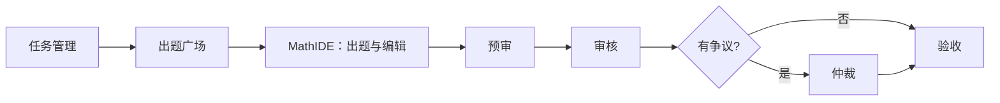

# MathTasks 前端与 MathIDE 设计说明

## 1. 产品界面定位

MathTasks 的前端由两种互补的界面模式组成：

1. **任务协作后台**：围绕任务、用户和题目流转的管理界面。
2. **MathIDE 工作台**：围绕单一道题目的编写、AI 协作、质检与审批的沉浸式编辑界面。

业务路径为：`任务管理 → 出题 → 预审 → 审核 → 仲裁（可选）→ 验收`。各广场是各角色待办任务的入口；MathIDE 是题目实际被创建、编辑及评审的核心工作区。



## 2. 全站前端架构

| 层级 | 主要位置 | 职责 |
| --- | --- | --- |
| 路由页面 | `frontend/app/` | 登录、广场、管理页与 MathIDE 的页面编排 |
| 共享组件 | `frontend/components/` | 导航、权限保护、抽屉、表单、shadcn UI 基础组件 |
| 全局状态 | `frontend/context/AuthContext.tsx` | JWT、当前用户、角色与权限判断 |
| 接口层 | `frontend/lib/api.ts` | API 基址、携带认证头、过期登录跳转 |
| 领域类型 | `frontend/types/` | 任务、题目、审核与验收类型 |

主路由包括：

- `/square/creation`：出题广场
- `/square/pre-review`、`/square/review`、`/square/arbitration`、`/square/validation`：流程广场
- `/admin/tasks`、`/admin/users`：管理员界面
- `/mathide?task_id=…&problem_id=…`：某一道题目的工作台

MathIDE 必须绑定 `problem_id` 使用；出题广场创建或领取题目后，会携带题目、任务和对话线程参数打开它。

## 3. 全站视觉风格

### 3.1 关键词

**浅色、专业、克制、数据工作台、柔和科技感。**

- 基底：`slate-50` / 近白蓝灰背景。
- 卡片：白色或半透明白色、细浅灰边框、柔和阴影与轻微毛玻璃。
- 品牌强调色：天空蓝到青色渐变；主色约为 `hsl(199 89% 48%)`。
- 文字：深靛蓝黑作为主文字，灰蓝用于次级说明。
- 圆角：全局基准为 `16px`；导航胶囊、卡片、输入框均使用较大圆角。
- 图标：Lucide 线性图标，尺寸小且用作文字导航的辅助。

### 3.2 设计令牌

`app/globals.css` 将语义色定义为 CSS 变量，并由 Tailwind 映射为 `background`、`foreground`、`card`、`primary`、`muted` 等颜色。项目提供 `.dark` 变量集；MathIDE 面板另有独立的浅/深色变量。

常见交互反馈：

- 当前导航项：深色实心胶囊 + 白色文字。
- 普通导航项：深灰文字，悬停浅灰底。
- 主要操作：蓝—青渐变、阴影。
- 错误：红色；流程状态使用灰 / 黄 / 蓝 / 绿 / 红表达未开始、待处理、处理中、通过和驳回。
- 动效：短时 `ease-out`、淡入上移、软脉冲与手风琴动画；避免重型装饰动画。

### 3.3 管理与广场页面布局

`DashboardShell` 提供统一的协作后台骨架：

1. 顶部粘性导航栏：品牌、按权限过滤的广场/管理入口、账户菜单。
2. 桌面端横向导航：圆角胶囊按钮；移动端改为横向滚动按钮带。
3. 内容区：大留白、可选标题卡、列表或任务卡。
4. 详情操作：常以 Drawer 承载，避免反复离开当前任务列表。

## 4. MathIDE 组件结构

### 4.1 页面编排

`app/mathide/page.tsx` 负责读取 URL 参数、识别出题/预审/审核/仲裁/验收模式，并根据题目状态选择初始标签页。`MathIDEPageContent` 将工作台拆为三块：

```text
MathIDEPageContent
├─ MathIDEPanel（左/右停靠或浮动的业务面板）
├─ StateFlowVisualizer（可拖动的题目状态流转浮层）
└─ DocumentEditor（主编辑区）
   ├─ Toolbar / BubbleMenu / FloatingMenu
   ├─ TipTap 文档编辑器
   ├─ ActionPanel（自查、统计、动作）
   └─ StatusBar（保存状态、AI 状态）
```

主编辑区会根据面板宽度动态设置左右边距，避免固定侧栏遮挡正文；布局完成后才启用过渡，以减少水合和拖拽时的跳动。

### 4.2 `MathIDEPanel`：可操作的流程侧栏

这是 MathIDE 的主要控制界面，具备：

- 左停靠、右停靠和自由浮动三种位置模式。
- 面板拖拽、边缘/角落缩放；停靠模式仅暴露必要的缩放边。
- 打开/关闭状态、尺寸、停靠方式与主题的本地持久化。
- `Ctrl/Cmd + K` 快捷键开关；关闭后保留可拖动的唤起按钮。
- 面板标题、主题切换、搜索、标签页和题目状态流入口。

面板标题为 **MathIDE / 析望数据实验室**。它使用白色（深色模式为深灰）表面、浅灰边线、较大的柔影和蓝色活动态，视觉上接近专业 IDE 的辅助工具窗格，而不是传统聊天抽屉。

### 4.3 业务标签页

面板通过 `buildPanelTabs` 按题目与流程状态生成内容：

| 标签 | 作用 | 可编辑条件 |
| --- | --- | --- |
| 出题 | AI 协作出题与文档写入 | 草稿阶段；提交后只读 |
| 预审 | 质量预审 | 预审待处理或处理中 |
| 审核 | 审核、仲裁申请和返修关联 | 审核待处理或处理中 |
| 仲裁 | 争议处理 | 仲裁模式 |
| 验收 | 最终验收 | 验收模式 |
| 事件 / 数据 / 设置 / 帮助 | 辅助信息与配置 | 次级标签 |

这使同一工作台能随题目生命周期切换职责，而不是为每个角色复制一套编辑页面。

### 4.4 `DocumentEditor`：题目正文工作区

编辑器基于 TipTap，提供：

- 顶部工具栏、选区浮动菜单和空段落浮动菜单。
- 富文本、表格、代码块、图片、链接、文本颜色和对齐等能力。
- KaTeX 数学公式样式与 HTML 格式的题目结构。
- 自动保存、加载错误反馈和底部状态栏。
- 预览模式，以及 AI 生成内容的差异高亮与“接受/拒绝”确认。
- 返修题与原题之间的互链。
- 出题时默认展开的自查/统计动作面板；进入评审、验收、仲裁时默认收起，减少阅读干扰。

AI 写入约定为三段 HTML：`.problem-content`、`.analysis`、`.answer`。新增内容以浅绿与绿线标识，删除内容以浅红和删除线标识，便于人工确认 AI 改动。

### 4.5 `StateFlowVisualizer`：流程可视化

状态流转入口位于面板搜索行右侧。打开后显示可拖动浮层，使用 Mermaid 渲染流程图，并配合状态徽章和图例。状态颜色保持统一：

| 颜色 | 含义 |
| --- | --- |
| 灰 | 草稿、未开始 |
| 黄 | 待处理 |
| 蓝 | 处理中、已提交 |
| 绿 | 通过 |
| 红 | 驳回、失效 |

## 5. MathIDE 与全站风格的差异

| 维度 | 广场/管理页 | MathIDE |
| --- | --- | --- |
| 使用目标 | 浏览、筛选、分派和管理 | 深度创作、审阅和决策 |
| 结构 | 顶部导航 + 卡片/表格/抽屉 | 全屏编辑器 + 可调整工具面板 |
| 密度 | 中低密度，强调留白与任务概览 | 高密度，强调可用工作面积 |
| 交互 | 页面导航、弹窗、抽屉 | 停靠、浮动、缩放、快捷键、编辑器上下文菜单 |
| 视觉重心 | 青蓝品牌渐变与白色卡片 | 中性 IDE 表面 + 蓝色活动态 + 流程状态色 |

## 6. 实施观察与建议

- MathIDE 首次进入需要加载编辑器、CopilotKit、Mermaid 和较多业务组件；开发模式首编译会显著慢于后续访问。生产环境应通过构建产物、按需加载和对 Mermaid/CopilotKit 做动态导入降低首次等待。
- 设计系统已经有清晰的全局语义色与 MathIDE 面板变量，但两者存在两套颜色命名；后续可将面板变量映射到全局令牌，便于主题一致性维护。
- MathIDE 的“上下文进入”方式正确：应从任务/题目记录进入，而非把 `/mathide` 暴露为无参数的普通导航项。

## 7. 关键实现位置

- MathIDE 路由与状态选择：`frontend/app/mathide/page.tsx`
- MathIDE 总体布局：`frontend/app/mathide/_components/shared/MathIDEPageContent.tsx`
- 可调整侧栏：`frontend/app/mathide/_components/mathide-panel/MathIDEPanel.tsx`
- 面板主题变量：`frontend/app/mathide/_components/mathide-panel/MathIDEPanel.css`
- 标签页配置：`frontend/app/mathide/_components/mathide-panel/panelTabs.tsx`
- 富文本编辑器：`frontend/app/mathide/_components/tiptap-editor/DocumentEditor.tsx`
- 状态流程图：`frontend/app/mathide/_components/state-flow-visualizer/StateFlowVisualizer.tsx`
- 全站样式变量：`frontend/app/globals.css`
- 后台骨架与导航：`frontend/components/dashboard/shell.tsx`、`frontend/components/dashboard/nav.ts`
